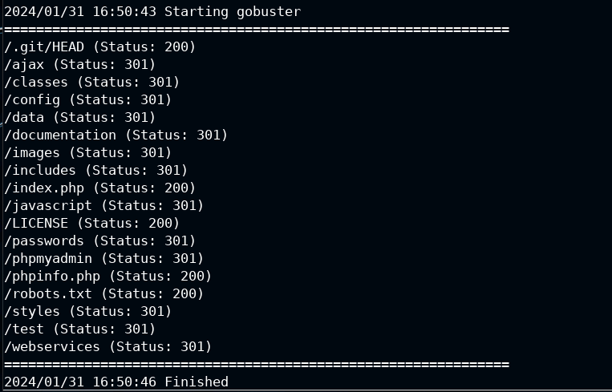
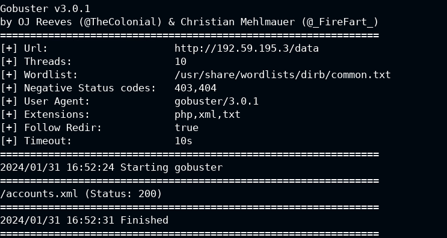

# Directory-Enumeration-with-Gobuster
Let's see how to Directory Enumeration with Gobuster
# Introduction of the tool
## Gobuster
Gobuster is a tool used to brute-force various targets such as URIs, DNS subdomains, virtual hosts, and cloud buckets. It is written in Go and can operate in different modes depending on the type of enumeration you want to perform. 
 

## Usage:
gobuster [command]

### Available Commands:
 - dir         **(Uses directory/file enumeration mode)**
 - dns         **(Uses DNS subdomain enumeration mode)**
 - fuzz        **(Uses fuzzing mode. Replaces the keyword FUZZ in the URL, Headers and the request body)**
 - gcs         **(Uses gcs bucket enumeration mode)**
 - help        **(Help about any command)**
 - s3          **(Uses aws bucket enumeration mode)**
 - tftp        **(Uses TFTP enumeration mode)**
 - version     **(shows the current version)**
 - vhost       **(Uses VHOST enumeration mode (you most probably want to use the IP address as the URL parameter)**

#### Flags:
   - -h, --help                  help for gobuster
   - --no-color                  Disable color output
   - --no-error                  Don't display errors
   - -z, --no-progress           Don't display progress
   - -o, --output string         Output file to write results to (defaults to stdout)
   - -p, --pattern string        File containing replacement patterns
   - -q, --quiet                 Don't print the banner and other noise
   - -t, --threads int           Number of concurrent threads (default 10)
   - -v, --verbose               Verbose output (errors)
   - -w, --wordlist string       Path to the wordlist. Set to - to use STDIN.
   - --wordlist-offset int       Resume from a given position in the wordlist (defaults to 0)

**Use "gobuster [command] --help" for more information about a command.**
## Example of Directory Enumeration with Gobuster
In the Lab we have an instance of Mutillidae is running at port 80 of the target.  
gobuster dir -u http://192.59.195.3 -w /usr/share/wordlists/dirb/common.txt -b 403,404 (enumeration, ignoring status 403 and 404)  
 
gobuster dir -u http://192.59.195.3/data -w /usr/share/wordlists/dirb/common.txt -b 403,404 -x .php,.xml,.txt -r (Find the files with the extensions such as .php, .xml, .txt in the directory /data enumerated with the previous command)  
 
We found and account.xml, usefull for information gathering of the accounts.

#Author
<b>Xiao Li Savio Feng</b>
